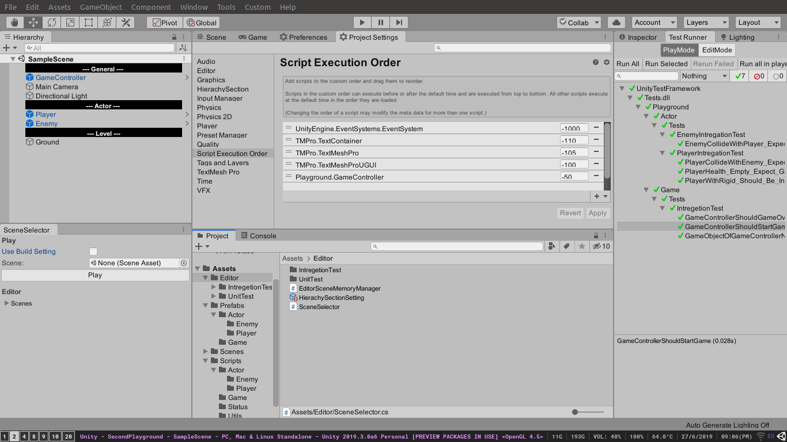

# SceneSelector
- Play a specific scene in unity playmode and jump back to current edit scene when finish playing.

# Install
Use unity package manager, install via git url.
>> url : https://github.com/CSaratakij/SceneSelector.git#upm

# Getting Started
1) Go to Window -> General -> Scene Selector
2) Add specific scene and hit play in SceneSelector's play button.
>> You can use Ctrl + Shift + P to start the first scene from the build setting

# Note
- If you enable "use build setting", It will open a scene with 0 index in the project build setting when enter a playmode. 

