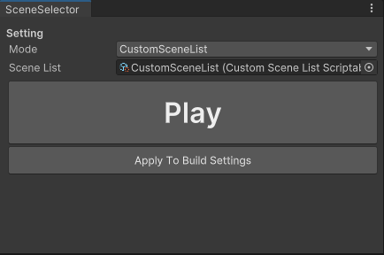

# SceneSelector
- Play a specific scene in unity playmode and jump back to current edit scene when finish playing

## Featured
- Backup & Restore scene list setup in BuildSettings
- Support multiple scene list profiles, great for teams that require multiple scene list setup for each team member
- Support playing from custom scene list in Editor without messing with BuildSettings's scene build index

## Install (TODO)
Use unity package manager, install via git url.
>> url : 

## Getting Started
1) Go to "Window -> General -> Scene Selector"
2) Select CustomFirstScene play mode
3) Add specific scene and hit play in SceneSelector's play button

### Play mode support
#### UseBuildSetting
- Use the first enabled scene in BuildSettings when enter playmode

#### CustomFirstScene
- Use the selected scene as the first scene when enter playmode

#### CustomSceneList
- Replace BuildSettings scene list setup with custom scene list profile, and use the first enabled scene in custom scene list when enter playmode
- Revert BuildSettings scene list setup to original after exit playmode

##### Create the new CustomSceneList Profile
- From ProjectWindow "Create > SceneSelector > CustomSceneList", then you can use this profile with CustomSceneList playmode

### Note
- If you want to use legacy version of Scene Selector, define 'SCENE_SELECTOR_ENABLE_LEGACY' flags

- Enjoy what you see? [__Buy me a coffee! :coffee:__](https://www.buymeacoffee.com/CSaratakij)
